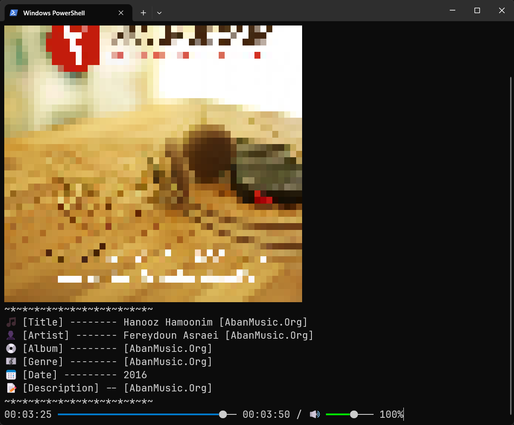
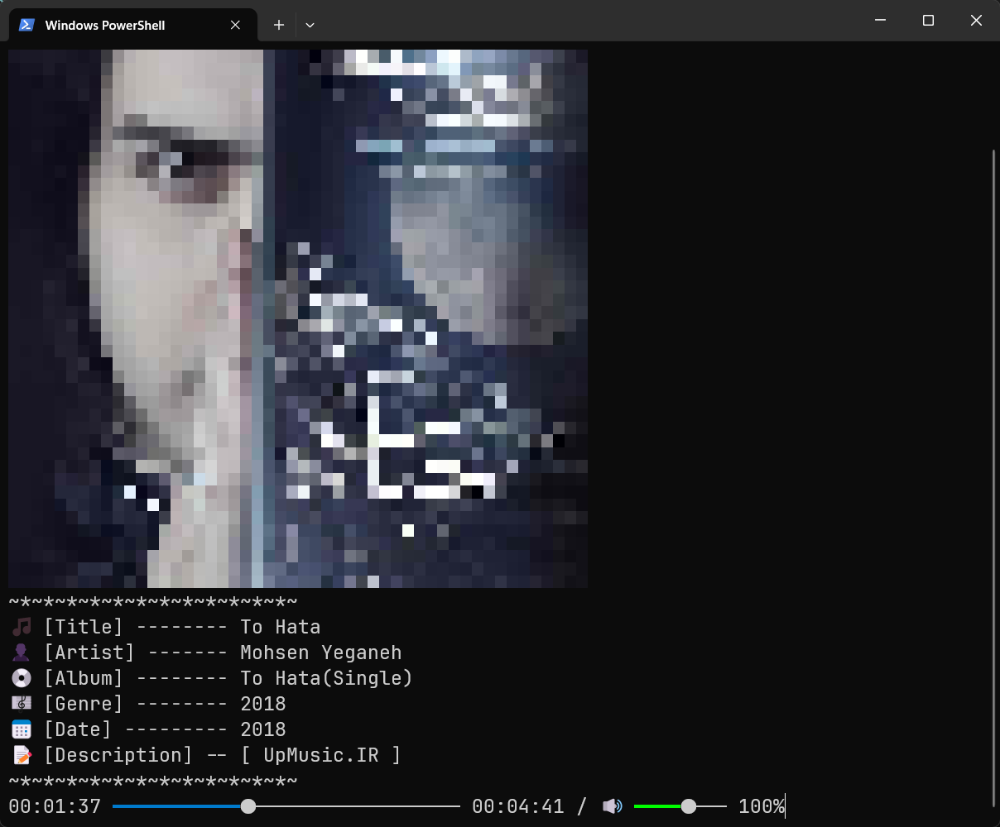
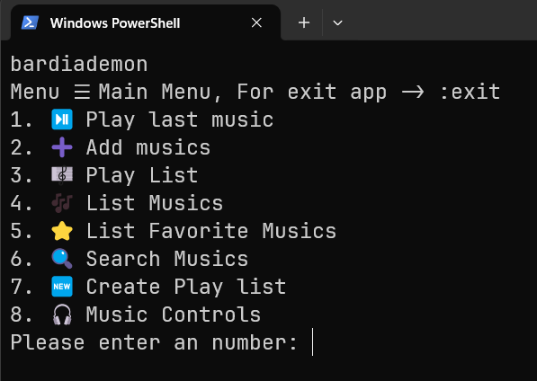

# 🎵 Terminal Music Player

<div style="display:inline-block;">
  
  
  
</div>

This project is a **terminal-based music player** that runs entirely in the terminal and supports playing various audio file formats.

It uses **JVLC** for music playback.

---

## 📝 Prerequisites and Installation

Follow these steps to set up and run the application:

1. Install **Java 21** or higher  
   (You can use [Oracle JDK](https://www.oracle.com/java/technologies/downloads/) or [OpenJDK](https://openjdk.org/install/))

2. Install **Maven**  
   (For building and managing the project)

3. Install **VLC media player**

4. Install **MySQL**
   > The database username and password can be changed in the `DatabaseConnection` file.

5. Clone the project repository:
   ```bash
   git clone [project git URL]
   ```

6. Execute the `initial_mysql.sql` script located in the `resources/patch` directory on your MySQL database.

7. Build the project using Maven:
   ```bash
   mvn clean install package
   ```

8. Navigate to the `target` directory:
   ```bash
   cd target
   ```

9. Set UTF-8 encoding for Windows:
   ```shell
   $OutputEncoding = [Console]::OutputEncoding = [Text.UTF8Encoding]::new()
   ```
10. Run the application:
   ```bash
   java -jar terminal-music-[version].jar
   ```
---

## 🚀 Features

- Playlist management
- Music selection
- Music playback controls

## 💻 Technologies


## 📢 Spread the word!

If you want to say thank you:

- Add a GitHub Star to the project!
- Follow my GitHub [bardiademon](https://github.com/bardiademon)

